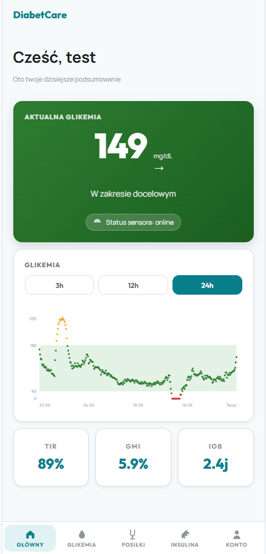
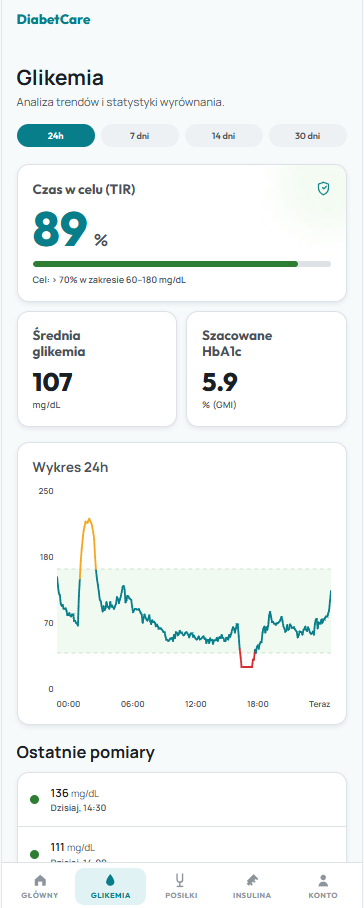
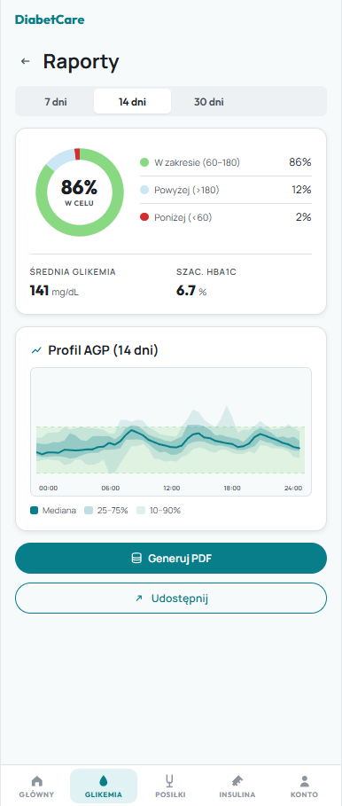
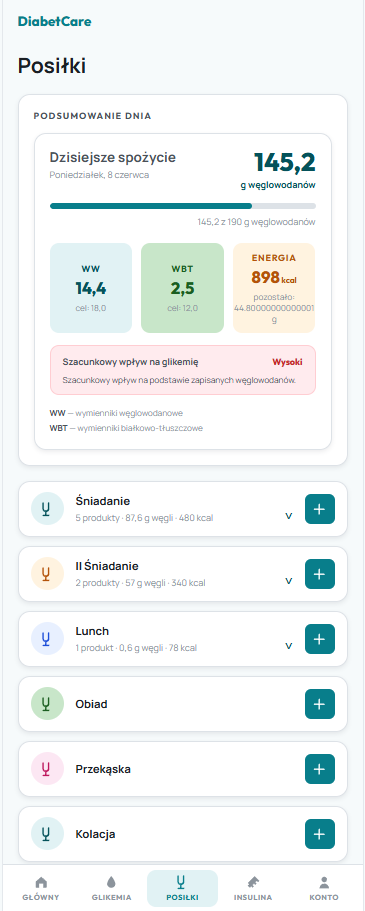
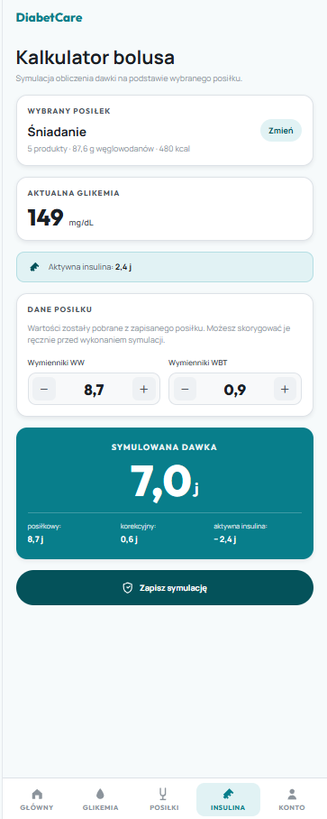
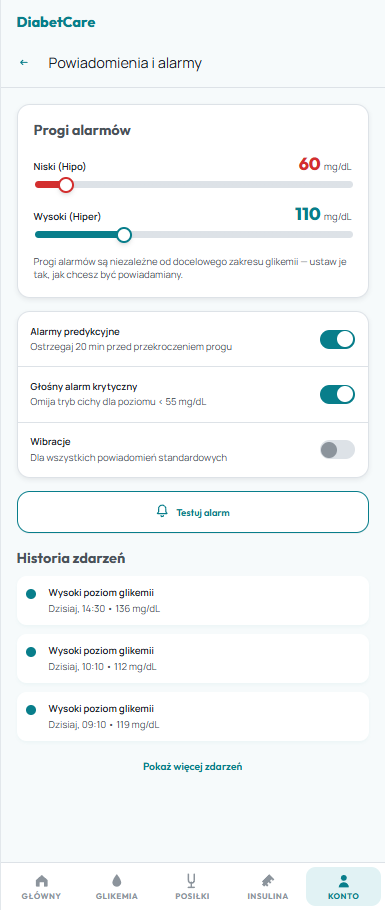
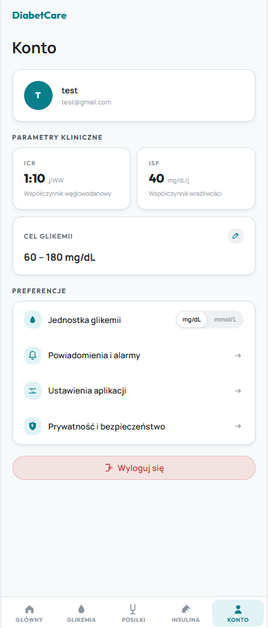
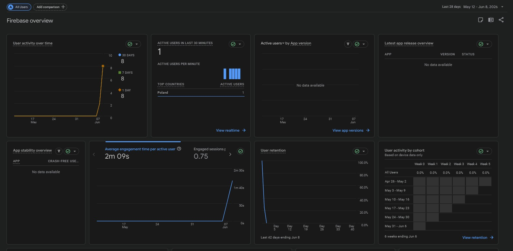
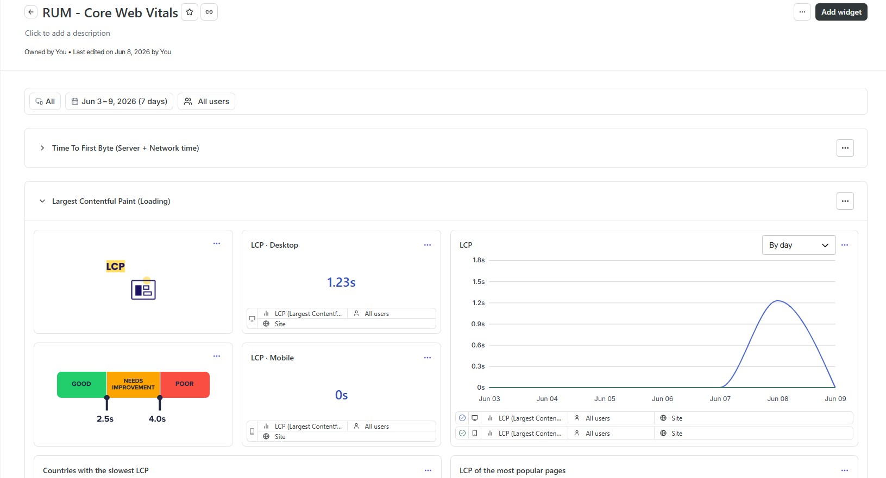

# DiabetCare

Aplikacja webowa typu **CGM** (Continuous Glucose Monitoring) wspierająca codzienne zarządzanie cukrzycą: podgląd bieżącej glikemii, analiza trendów, raporty AGP w formacie PDF, liczenie posiłków (WW/WBT), kalkulator bolusa insuliny oraz konfiguracja alarmów. Frontend jest w pełni funkcjonalny, dane CGM pochodzą z realistycznego mocka, a logowanie zrealizowano w oparciu o **Firebase Authentication**.

Projekt odwzorowuje prototyp z Figmy: [TPF — Figma](https://www.figma.com/design/5KlJyivi0BxUVi4iVKdcy6/TPF).

---

## Spis treści

- [Stos technologiczny](#stos-technologiczny)
- [Uruchomienie lokalne](#uruchomienie-lokalne)
- [Zmienne środowiskowe](#zmienne-środowiskowe)
- [Routing — wszystkie ekrany](#routing--wszystkie-ekrany)
- [Struktura projektu](#struktura-projektu)
- [Komponenty reużywalne](#komponenty-reużywalne)
- [Logowanie (Firebase Authentication)](#logowanie-firebase-authentication)
- [Google Analytics](#google-analytics)
- [Hotjar](#hotjar)
- [Warstwa danych (mock CGM)](#warstwa-danych-mock-cgm)
- [Deploy](#deploy)
- [Zrzuty ekranu aplikacji](#zrzuty-ekranu-aplikacji)
- [Zrzuty ekranu — Google Analytics](#zrzuty-ekranu--google-analytics)
- [Zrzuty ekranu — Hotjar](#zrzuty-ekranu--hotjar)
- [Mapowanie wymagań na realizację](#mapowanie-wymagań-na-realizację)

---

## Stos technologiczny

| Warstwa | Technologia |
|---|---|
| Framework | React 19 + TypeScript |
| Bundler | Vite 8 |
| Routing | `react-router-dom` 7 (`BrowserRouter`) |
| Autoryzacja | Firebase Authentication (Email/Password) |
| Analityka zdarzeń | Google Analytics (Firebase Analytics) |
| Analiza zachowań | Hotjar |
| Style | Czyste CSS z design tokenami, pliki per-feature |
| Czcionki | Outfit, Manrope z Google Fonts |
| Ikony | Inline SVG |
| Dane CGM | Mock z pliku `public/cgm-data.csv` (skrypt w Pythonie) |

---

## Uruchomienie lokalne

```bash
npm install
npm run dev
```

---

## Zmienne środowiskowe

Konfiguracja Firebase jest wczytywana z `import.meta.env`. Utwórz plik `.env.local` w katalogu głównym:

```env
VITE_FIREBASE_API_KEY=...
VITE_FIREBASE_AUTH_DOMAIN=...
VITE_FIREBASE_PROJECT_ID=...
VITE_FIREBASE_STORAGE_BUCKET=...
VITE_FIREBASE_MESSAGING_SENDER_ID=...
VITE_FIREBASE_APP_ID=...
VITE_FIREBASE_MEASUREMENT_ID=...   # włącza Google Analytics (GA4)
```

> Bez `VITE_FIREBASE_MEASUREMENT_ID` warstwa analityki cicho się wyłącza (aplikacja działa normalnie, ale nie wysyła zdarzeń do GA).

---

## Routing — wszystkie ekrany

Routing oparty o `react-router-dom`. Nawigacja między ekranami odbywa się **bez przeładowania strony**. Trasy są chronione: niezalogowany użytkownik ma dostęp wyłącznie do ekranów autoryzacji, a próba wejścia gdziekolwiek indziej przekierowuje na `/login`. Istnieje fallback dla nieistniejących ścieżek (`*`).

### Trasy publiczne

| Ścieżka | Ekran | Opis |
|---|---|---|
| `/login` | Logowanie | Formularz e-mail + hasło |
| `/register` | Rejestracja | Tworzenie konta |
| `/forgot-password` | Reset hasła | Wysyłka e-maila resetującego |
| `*` | — | Przekierowanie na `/login` |

### Trasy chronione

| Ścieżka | Ekran | Opis |
|---|---|---|
| `/` | Główny (Dashboard) | Bieżąca glikemia, wykres 3h/12h/24h, TIR/GMI/IOB |
| `/sensor` | Status sensora | Stan, kalibracja, historia, parowanie |
| `/glycemia` | Glikemia | Analiza trendów 24h/7d/14d/30d, ostatnie pomiary |
| `/glycemia/reports` | Raporty | Statystyki + profil AGP, generowanie PDF |
| `/meals` | Posiłki | Bilans WW/WBT, dodawanie produktów |
| `/insulin` | Insulina | Kalkulator bolusa na podstawie posiłku |
| `/account` | Konto | Profil, parametry kliniczne, preferencje |
| `/account/target` | Cel glikemii | Edycja zakresu docelowego |
| `/account/privacy` | Prywatność | Zmiana hasła, usunięcie konta |
| `/account/alarms` | Alarmy | Progi alarmów, historia zdarzeń |
| `/account/settings` | Ustawienia | Jednostki, motyw, preferencje aplikacji |
| `*` | — | Przekierowanie na `/` |

---

## Struktura projektu

Ekrany (strony związane z routingiem) znajdują się w `src/features/<obszar>/`. Każdy obszar funkcjonalny ma własny komponent-ekran oraz dedykowany plik CSS. Współdzielone elementy UI są w `src/components/`.

```
src/
├── components/            # Reużywalne komponenty UI (Button, Card, Icon, Input)
├── contexts/             # Konteksty globalne (jednostka, cel glikemii, motyw)
├── design-system/        # Tokeny projektowe (kolory, spacing, promienie)
├── layouts/
│   └── AppShell.tsx      # Wspólny layout: nagłówek + dolna nawigacja
├── lib/
│   ├── firebase.ts       # initializeApp + getAuth
│   ├── auth.ts           # Logowanie/rejestracja/reset/wylogowanie + reauth
│   └── analytics.ts      # Google Analytics (GA4) — trackEvent / trackScreen
├── features/             # Ekrany aplikacji (pełne widoki = "pages")
│   ├── login/            # LoginView, RegisterView, ForgotPasswordView
│   ├── dashboard/        # DashboardView + kafelki (tiles/)
│   ├── glycemia/         # GlycemiaView (analiza trendów)
│   ├── reports/          # ReportsView + generator PDF (reportDocument.ts)
│   ├── meals/            # MealsPage, AddMealProductPage
│   ├── insulin/          # InsulinView (kalkulator bolusa)
│   ├── alarms/           # AlarmsView (progi + historia)
│   ├── sensor/           # SensorStatusView (kalibracja, parowanie)
│   └── account/          # AccountView, PrivacyView, AppSettingsView, GlycemiaTargetEditView
├── mocks/                # Zamockowane API + przetwarzanie danych CGM
│   ├── api.ts            # api.getGlycemiaChart(), api.getReportData() itd.
│   ├── cgmData.ts        # Loader CSV, statystyki, AGP, alarmy
│   └── types.ts          # Typy danych
├── App.tsx               # Definicje tras (Routes/Route) + ochrona tras + GA
├── main.tsx              # BrowserRouter + providery kontekstów
└── index.css             # Globalne CSS i design tokeny

public/
└── cgm-data.csv          # Mock realnych pomiarów CGM (30 dni co 5 min)

scripts/
└── generate_cgm_csv.py   # Generator realistycznych danych CGM

docs/
└── screenshots/          # Zrzuty ekranu do dokumentacji
```

---

## Komponenty reużywalne

Powtarzalne elementy UI wydzielono do `src/components/` i są używane w wielu ekranach, przyjmując propsy:

| Komponent | Propsy (wybrane) | Użycie |
|---|---|---|
| `Button` | `variant`, `fullWidth`, `iconLeft`, `onClick` | Akcje w formularzach, CTA |
| `Card` | `title`, `tone`, `padded`, `className` | Kafelki dashboardu, sekcje |
| `Icon` | `name`, `size`, `style` | Spójny zestaw ikon SVG w całej aplikacji |
| `Input` | `label`, `type`, `value`, `onChange` | Pola formularzy logowania/rejestracji |

Dodatkowo dashboard korzysta z systemu **kafelków** (`features/dashboard/tiles/`) z rejestrem i wspólnym interfejsem `TileDefinition`, co pozwala dokładać/porządkować kafelki deklaratywnie.

---

## Google Analytics

Zintegrowane przez `firebase/analytics`. Ponieważ routing nie przeładowuje strony, **odsłony (screen_view) są wysyłane przy każdej zmianie trasy** — w `App.tsx` nasłuchiwana jest zmiana `location.pathname`, a `trackScreen()` raportuje nazwę ekranu.

Śledzone są również zdarzenia biznesowe: `login`, `sign_up`, `password_reset_request`, `change_password`, `delete_account_success`, `logout`. Implementacja: `src/lib/analytics.ts`.

Dodatkowo logowane są wybrane akcje w ustawieniach i prywatności, np. zmiana języka, trybu ciemnego, uprawnień oraz opcji synchronizacji. Do GA nie są wysyłane dane medyczne ani dane logowania użytkownika.

---

## Hotjar

Snippet śledzący zachowania użytkowników (Hotjar / Contentsquare) jest ładowany globalnie w `index.html`, dzięki czemu działa na wszystkich trasach:

```html
<script src="https://t.contentsquare.net/uxa/dcc98fb7e9769.js"></script>
```

Hotjar służy do analizy użyteczności interfejsu, np. nagrań sesji i map cieplnych. Przy wdrożeniu produkcyjnym wymagana jest zgoda użytkownika oraz maskowanie danych wrażliwych.

---

## Warstwa danych (mock CGM)

Dane glikemii pochodzą z pliku `public/cgm-data.csv` (30 dni, próbki co 5 min), wygenerowanego skryptem `scripts/generate_cgm_csv.py`. Skrypt symuluje realistyczny profil osoby z cukrzycą (TIR ~85%, epizody hipo- i hiperglikemii). Moduł `src/mocks/cgmData.ts` ładuje CSV i liczy statystyki (TIR, GMI, profil AGP, zdarzenia alarmowe), a `src/mocks/api.ts` wystawia asynchroniczne API zbliżone do realnego backendu.

Preferencje użytkownika, takie jak jednostka, zakres docelowy, progi alarmów, motyw, bieżąca glikemia z kalibracji są utrwalane w `localStorage`.

---

## Deploy

Aplikacja to statyczny build SPA (`npm run build` → `dist/`). W repozytorium znajdują się gotowe konfiguracje przekierowań dla SPA:

- **Vercel** — `vercel.json` (rewrite wszystkich ścieżek na `/index.html`)
- **Netlify** — `public/_redirects` (`/* /index.html 200`)

Przekierowania są niezbędne, aby odświeżenie strony na trasie innej niż `/` (np. `/account/alarms`) działało poprawnie przy routingu po stronie klienta.

> 🔗 **Adres produkcyjny:** 

---

## Zrzuty ekranu aplikacji

### Główny (Dashboard) — `/`
Bieżąca glikemia z trendem, przełączany wykres 3h/12h/24h (punkty kolorowane wg stref docelowych) oraz kafelki TIR / GMI / IOB.



### Glikemia — `/glycemia`
Analiza trendów dla zakresów 24h / 7 dni / 14 dni / 30 dni, czas w celu (TIR) oraz lista ostatnich pomiarów z doładowywaniem i zwijaniem.



### Raporty — `/glycemia/reports`
Statystyki wyrównania i dynamiczny profil AGP liczony z danych CSV dla wybranego okresu; przycisk generowania raportu PDF.



### Posiłki — `/meals`
Bilans węglowodanowy (WW/WBT) i energetyczny posiłku, lista produktów oraz przejście do kalkulatora bolusa.



### Insulina — `/insulin`
Kalkulator dawki bolusa na podstawie wybranego posiłku i parametrów klinicznych użytkownika.



### Alarmy — `/account/alarms`
Niezależne progi alarmu niskiego/wysokiego (suwaki), test alarmu z dźwiękiem oraz historia zdarzeń generowana z danych CGM, z limitem i doładowywaniem.



### Konto — `/account`
Profil użytkownika, parametry kliniczne, wejścia do ustawień (cel glikemii, prywatność, alarmy, ustawienia aplikacji) i wylogowanie.



---

## Zrzuty ekranu — Google Analytics
Statystyki aplikacji google analytics dashboard


---

## Zrzuty ekranu — Hotjar
Statystyki aplikacji LCP - Hotjar


---

